# SLAM14

**SLAM : Simultaneous Localization and Mapping**

**同时定位与地图构建**


## Chapter1

**1引言**

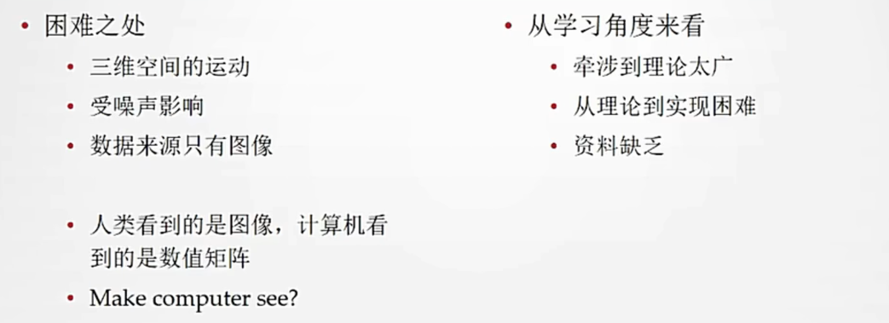


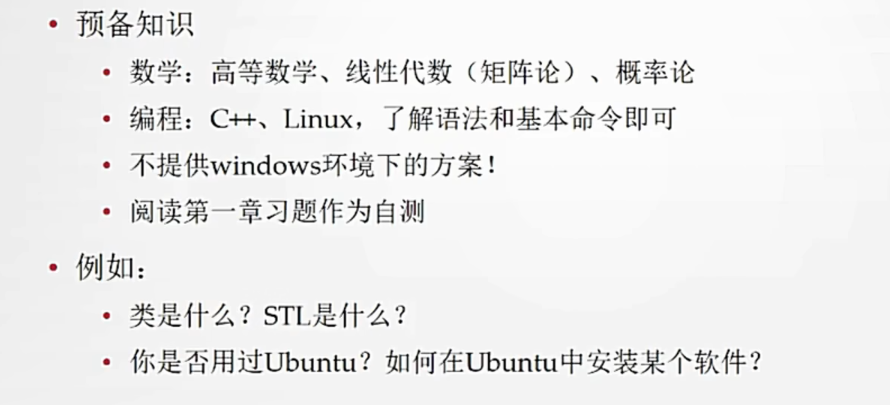

### 第一部分:数学基础

### 第二部分:视觉SLAM

### 第三部分:其他


## Chapter2

**内外兼修**

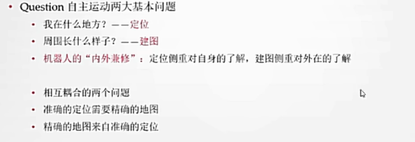


**传感器的配置**

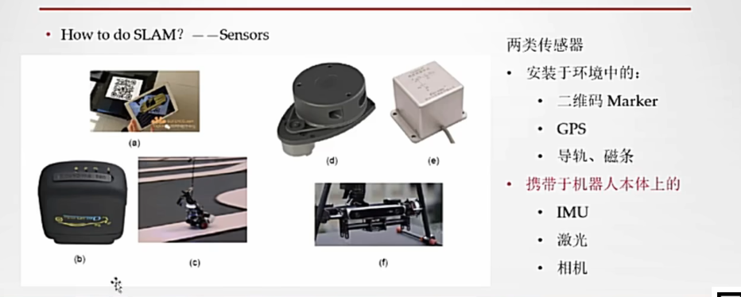


**环境中配置传感器**

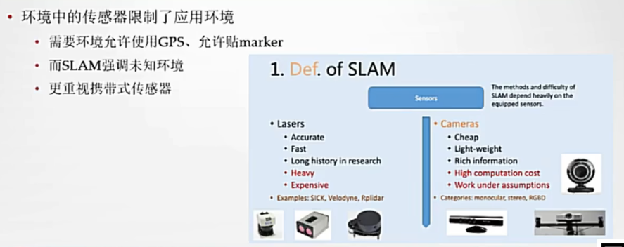


**相机分类**

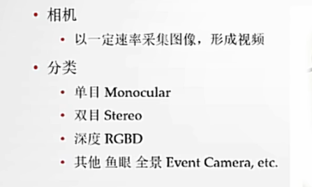


**相纸之间的差距**

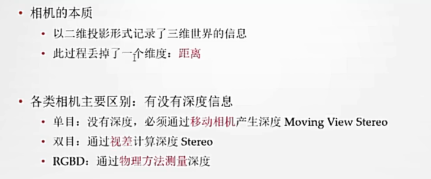


**单目相机的缺点**

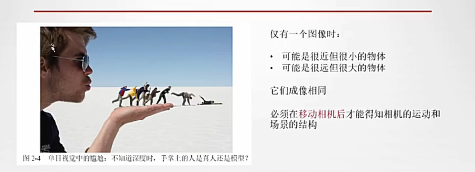


**单目相机**

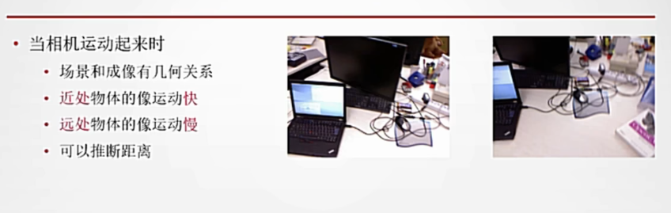


**双面相机**

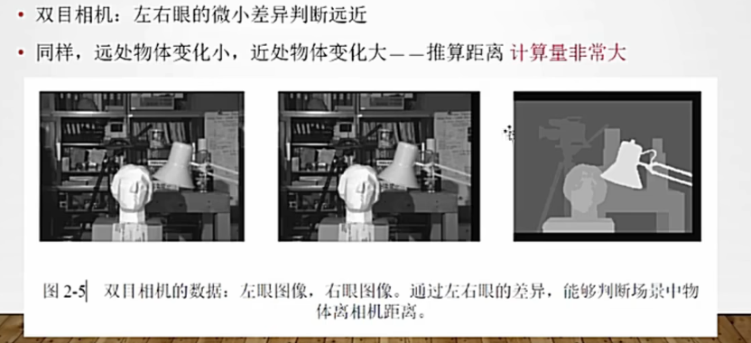


**深度相机**

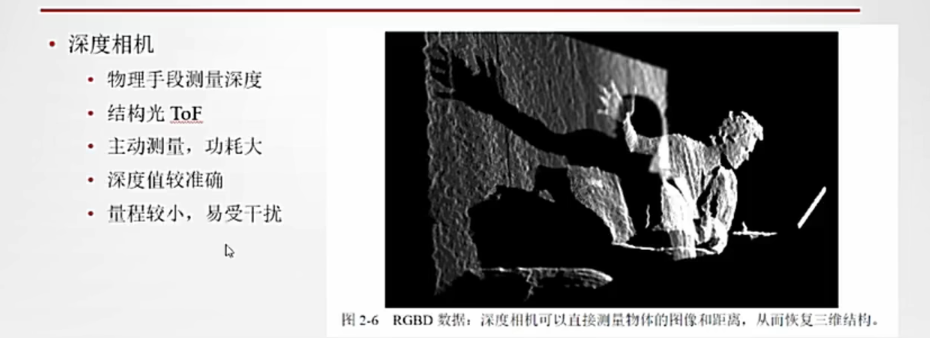


**共同点**

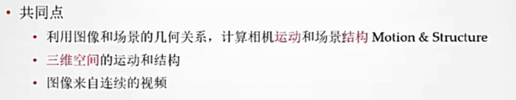


**视觉SLAM的做法**

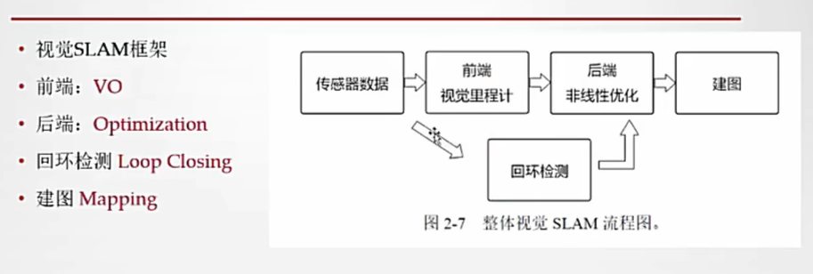


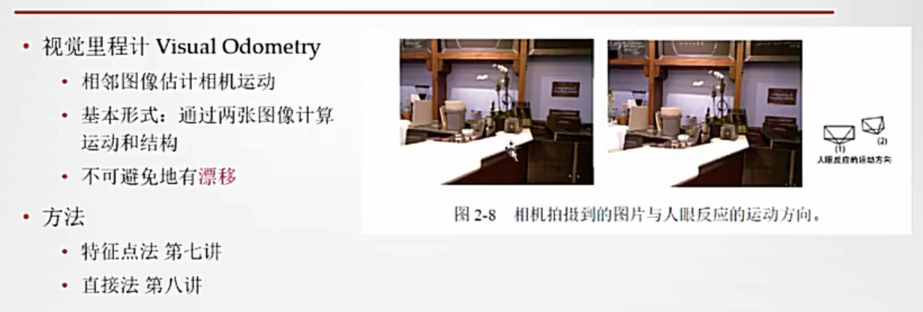


```
新图像进来
    ↓
前端（视觉里程计） → 快速算出当前位姿 + 新3D点
    ↓
如果这帧是关键帧 → 交给后端局部BA优化
    ↓
同时把这帧放进“词袋数据库”
    ↓
回环检测模块不断检索：有没有历史帧和当前帧很像？
    ↓ 是 → 加上回环约束 → 触发全局优化（后端）
    ↓ 否 → 继续往前走
    ↓
最终所有优化好的关键帧位姿 + 地图点 → 输出给建图模块
```


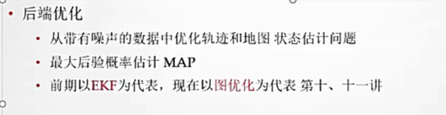

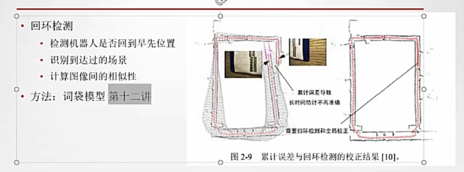

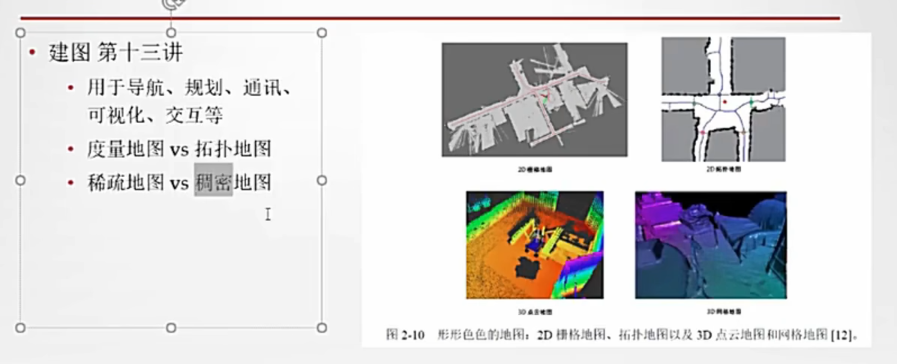


**SLAM数学问题**

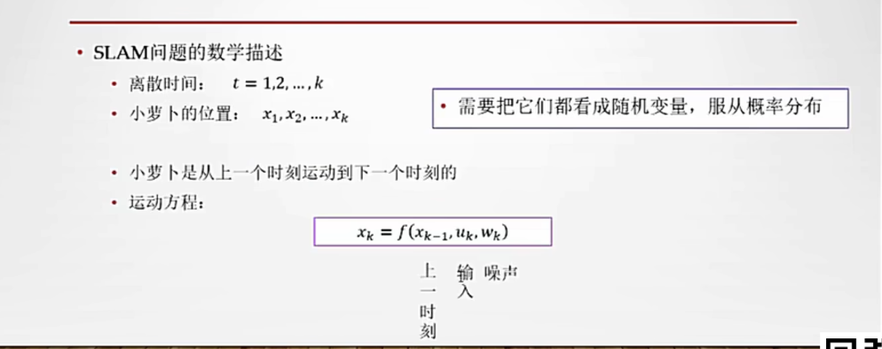

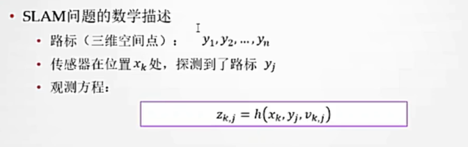

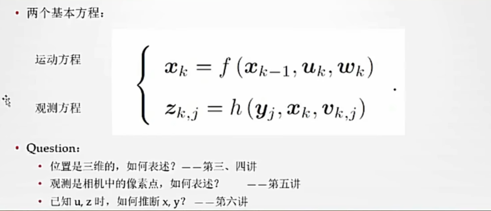


**cmake**

````


## ✅ 1. 基本结构模板

```cmake
cmake_minimum_required(VERSION 3.10)
project(MyProject)
set(CMAKE_CXX_STANDARD 17)

set(SRC main.cpp src/a.cpp src/b.cpp)
add_executable(my_app ${SRC})
target_link_libraries(my_app PRIVATE pthread)
```

---

## ✅ 2. 添加头文件路径

```cmake
include_directories(include)
# 或现代写法
target_include_directories(my_app PUBLIC include)
```

---

## ✅ 3. 添加源文件

```cmake
aux_source_directory(src SRC_LIST)
add_executable(my_app ${SRC_LIST})
```

---

## ✅ 4. 链接库

### 🔹 系统库

```cmake
target_link_libraries(my_app PRIVATE pthread dl m)
```

### 🔹 自己的 .a / .so

```cmake
link_directories(${PROJECT_SOURCE_DIR}/lib)
target_link_libraries(my_app PRIVATE mylib)
```

---

## ✅ 5. find_package 查找外部库

### OpenCV

```cmake
find_package(OpenCV REQUIRED)
include_directories(${OpenCV_INCLUDE_DIRS})
target_link_libraries(my_app PRIVATE ${OpenCV_LIBS})
```

### Eigen

```cmake
find_package(Eigen3 REQUIRED)
target_link_libraries(my_app PRIVATE Eigen3::Eigen)
```

### Pangolin

```cmake
find_package(Pangolin REQUIRED)
target_link_libraries(my_app PRIVATE ${Pangolin_LIBRARIES})
```

---

## ✅ 6. 编译选项

```cmake
add_compile_options(-Wall -Wextra -O2)
# 或
target_compile_options(my_app PRIVATE -O3 -march=native)
```

---

## ✅ 7. Debug / Release

```bash
cmake .. -DCMAKE_BUILD_TYPE=Release
cmake .. -DCMAKE_BUILD_TYPE=Debug
```

---

## ✅ 8. 控制输出路径

```cmake
set(CMAKE_RUNTIME_OUTPUT_DIRECTORY ${PROJECT_BINARY_DIR}/bin)
set(CMAKE_LIBRARY_OUTPUT_DIRECTORY ${PROJECT_BINARY_DIR}/lib)
```

---

## ✅ 9. 定义宏

```cmake
add_definitions(-DDEBUG)
# 或
target_compile_definitions(my_app PRIVATE DEBUG)
```

---

## ✅ 10. 添加子目录（多模块工程常用）

```cmake
add_subdirectory(src/moduleA)
add_subdirectory(src/moduleB)
```

---

## ✅ 11. 构建静态库/动态库

```cmake
add_library(my_lib STATIC src/a.cpp src/b.cpp)
# or
# add_library(my_lib SHARED src/a.cpp src/b.cpp)

target_include_directories(my_lib PUBLIC include)
```

---

## ✅ 12. configure_file（变量生成配置文件）

```cmake
configure_file(config.h.in config.h)
```

config.h.in 内容示例：

```c
#define VERSION_MAJOR @PROJECT_VERSION_MAJOR@
```

---

## ✅ 13. install 部署命令

```cmake
install(TARGETS my_app RUNTIME DESTINATION bin)
install(FILES config.yaml DESTINATION share)
install(DIRECTORY include/ DESTINATION include)
```

---

## ✅ 14. 最常用工作流

```bash
mkdir build
cd build
cmake ..
make -j8
```

带库路径：

```bash
cmake .. -DOpenCV_DIR=/usr/local/lib/cmake/opencv4
```


# ⭐ **CMake 速查表（1 分钟记住）**

| 功能     | 命令                                        |
| ------ | ----------------------------------------- |
| 设置项目   | `project()`                               |
| 最低版本   | `cmake_minimum_required()`                |
| C++ 标准 | `set(CMAKE_CXX_STANDARD 17)`              |
| 可执行文件  | `add_executable()`                        |
| 库文件    | `add_library()`                           |
| 链接库    | `target_link_libraries()`                 |
| 头文件目录  | `target_include_directories()`            |
| 查找库    | `find_package()`                          |
| 子目录    | `add_subdirectory()`                      |
| 编译选项   | `target_compile_options()`                |
| 宏定义    | `target_compile_definitions()`            |
| 输出路径   | `set(CMAKE_RUNTIME_OUTPUT_DIRECTORY ...)` |
| 安装部署   | `install()`                               |


````


## Chapter3

### 3.1点，向量和坐标，旋转矩阵。

**点**

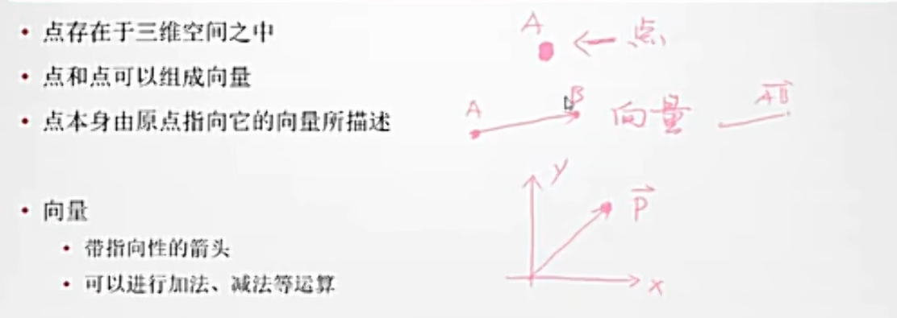

**坐标系**

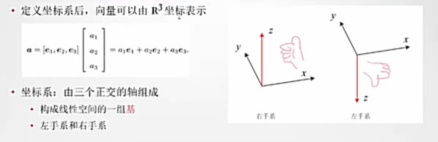

**向量的运算**

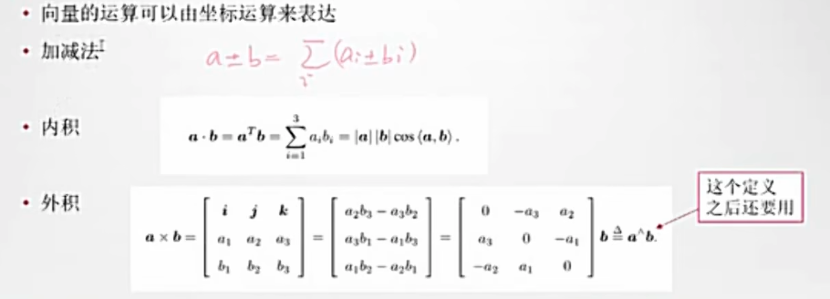

**反对称矩阵的**

**外积是面积**


**坐标的变换**

**世界坐标系**

**移动的机器人**

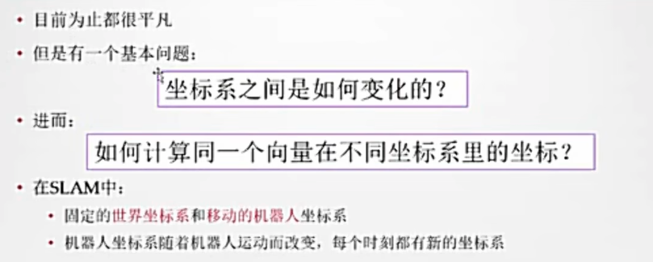


**平移+旋转**

**平移是一个向量，旋转是一个矩阵的**

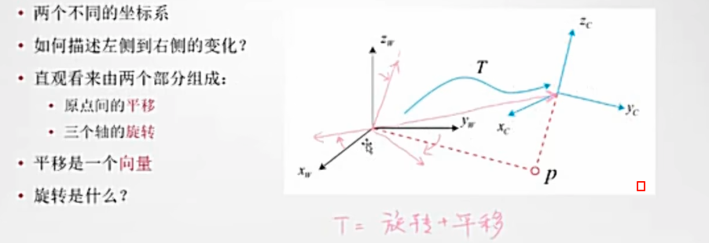


**旋转**

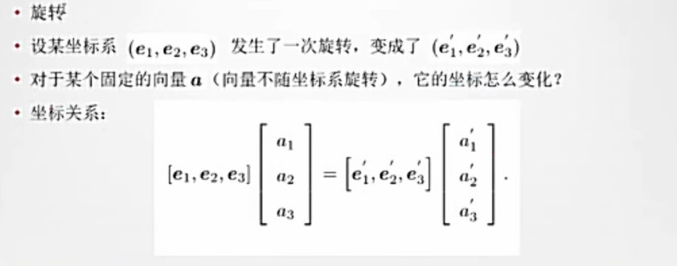

**标准正交基**

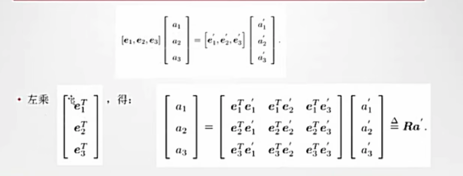

**旋转矩阵**


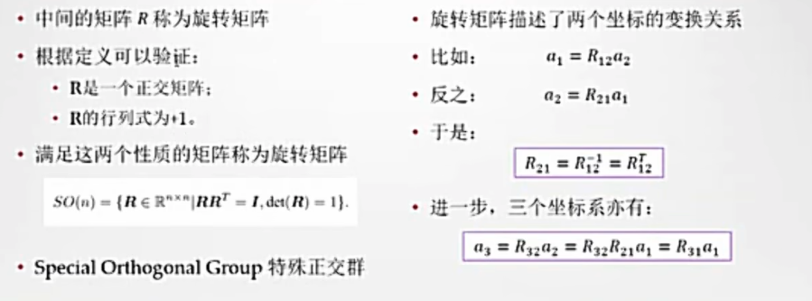

**旋转矩阵的性质**


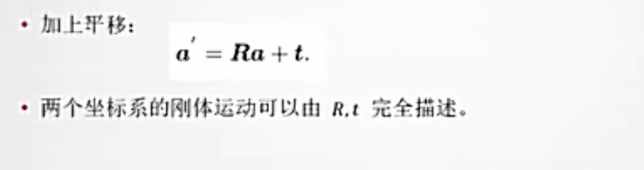

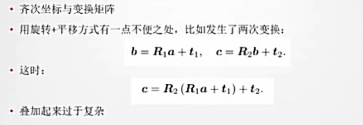

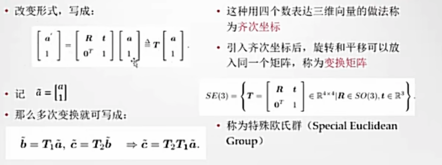


**R==3*3**  **T==3*1**


**Pr = Rrw * Pw**

### 3.2实践部分

### 3.3旋转向量，欧拉角

**角轴**


**角轴的特点**

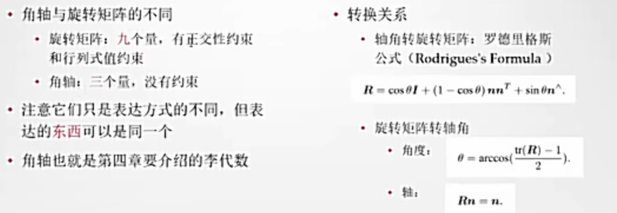

**角轴和旋转矩阵的转换**


**欧拉角**

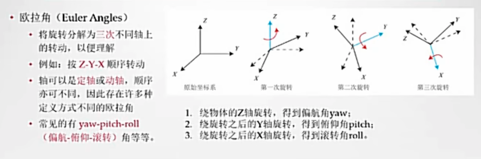

**分解旋转**

**z yaw, y pitch, w roll**

**万向锁的问题：丢失一个自由度的**


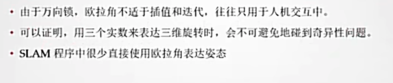

### 3.4四元数


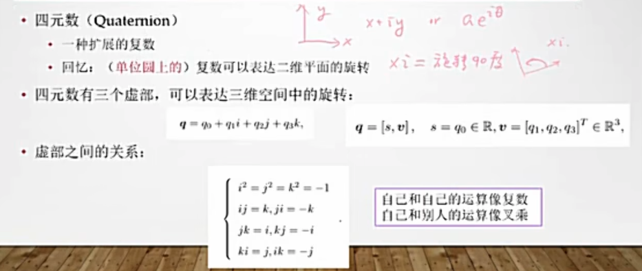


**四元数的运算**


**四元素的旋转**

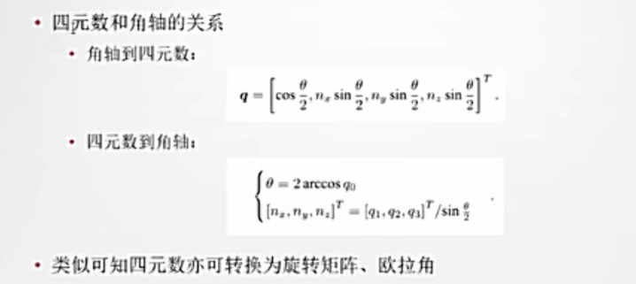


**四元数的优点：**

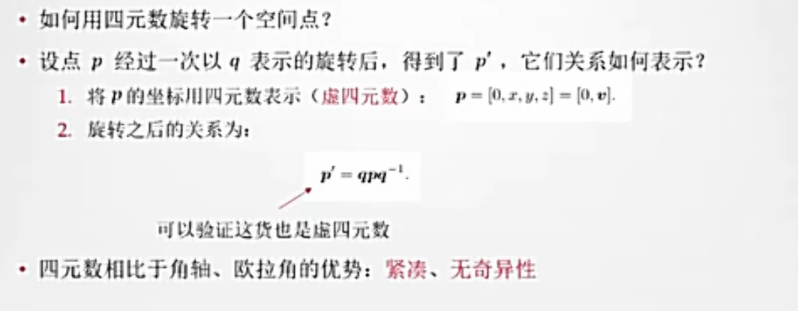

### 3.5相似，放射,

### 3.6eigen矩阵


## Chapter4

**李群与李代数**

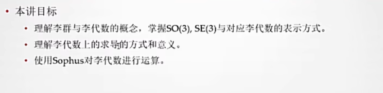

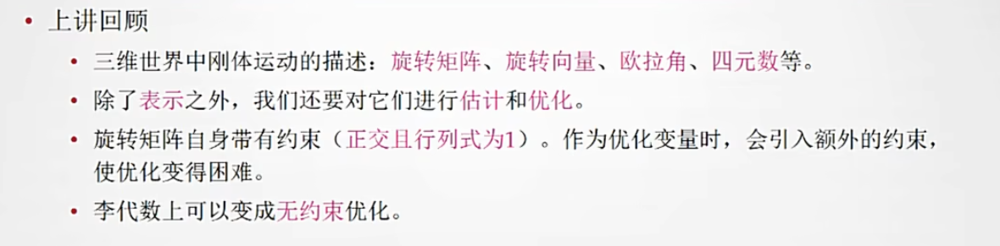


### 4.1李群李代数基础

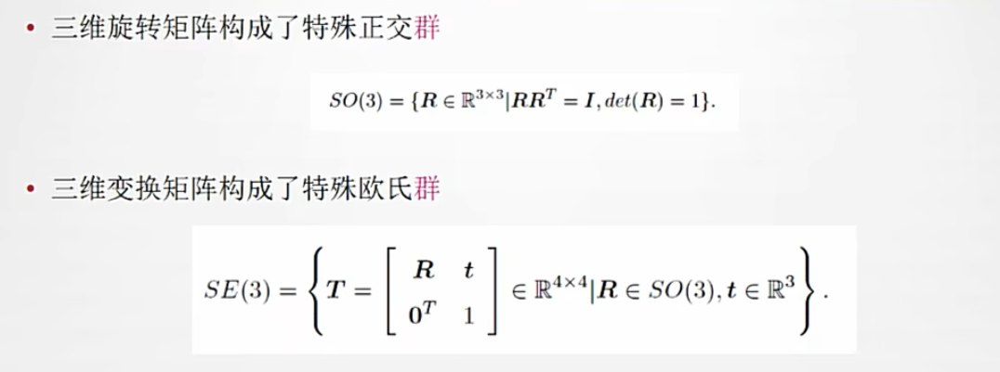


**什么是群**

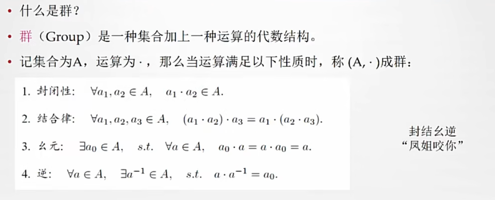

**一般的群**

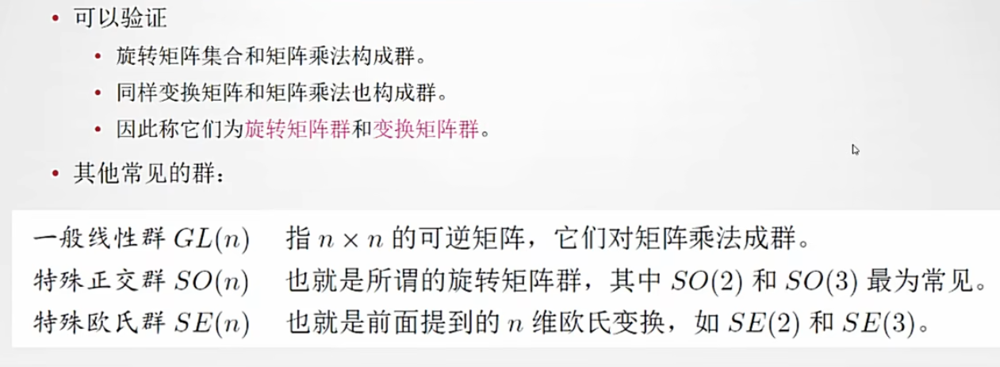

**群的优点**


**李代数**

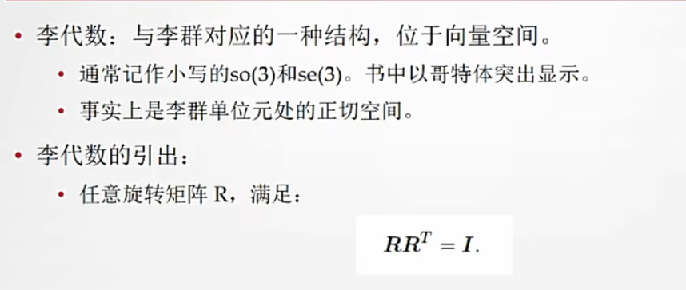

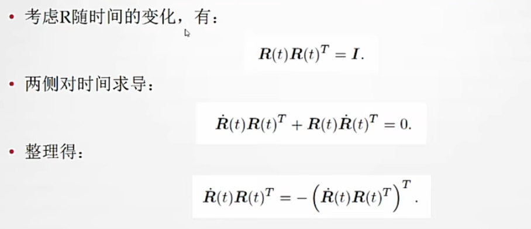

**反对称矩阵**

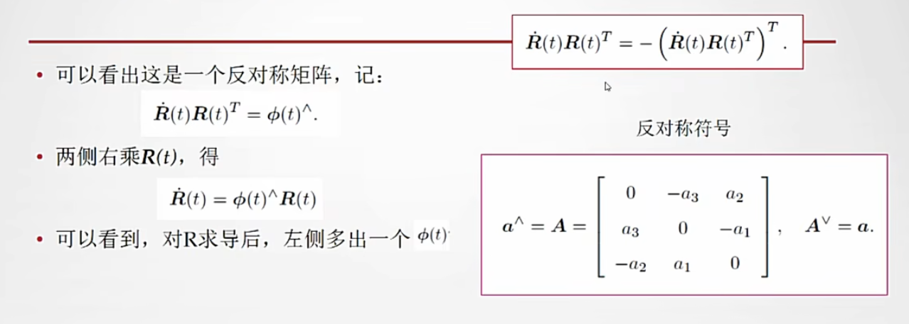


**泰勒展开了**

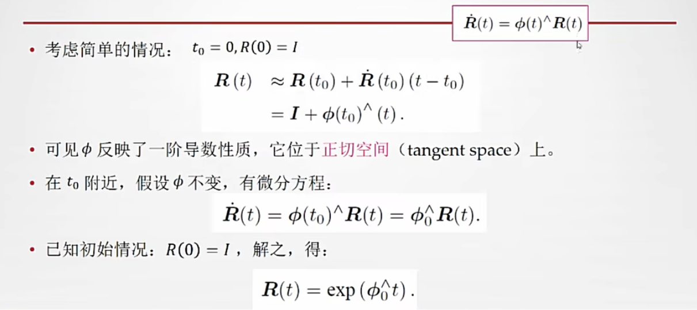


**李代数的定义：**

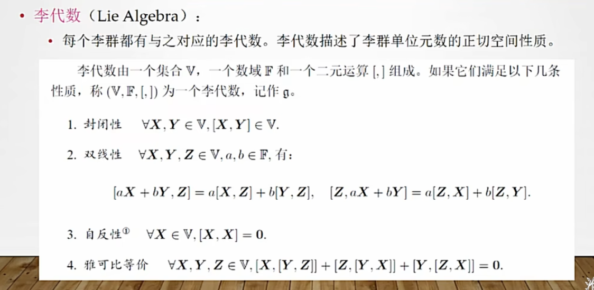


 

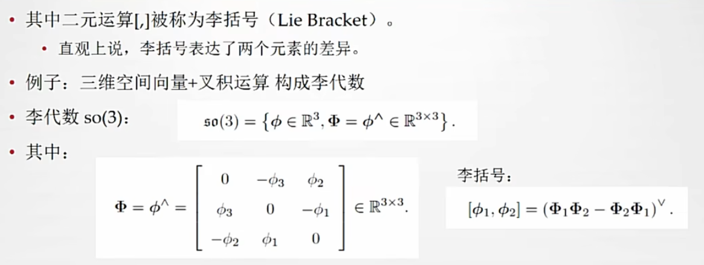


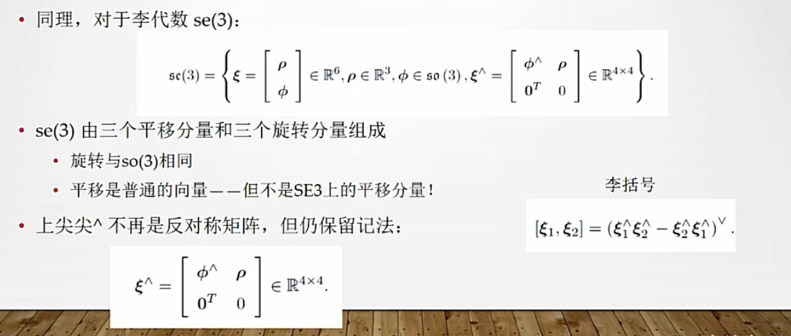


### 4.2指数映射和对数映射

**李群和李代数的映射**

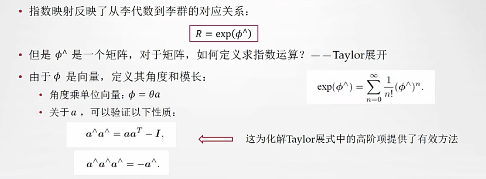

**化简得到的**


### 4.3李代数求导与扰动模型


**旋转**


**扰动和旋转的意义**


## Chapter5

**复习**


### 5.1相机模型


**建模**


**负号  东西翻转到前面来**

**像素  图像坐标和实际坐标的变化**


**畸变行为**


**畸变行为**


**畸变数学模型**


**畸变3-4之间**


**双目相机**


**RGB-D相机**


**缺点吸收光线了**


**OpenCV存放图片**


**图片二维矩阵存放的**

**注意存放的通道顺序和数量**


### 5.3基本图像处理

### 5.4点云拼接


## Chapter6

**非线性优化**


### 6.1状态估计


### 6.2非线性最小二乘法


### 6.3CERES库


### 6.4g20


## Chapter7

### 7.1特征点


**视觉 SLAM 的特征点，是在图像中选出的、可被稳定重复识别的局部显著区域，用来跨帧匹配、估计相机运动，并作为三维地图点的基础。**

**描述子（Descriptor）是对特征点局部外观的数值化编码，用来在不同图像中判断“是不是同一个物理点”。**

**FAST N :特征点周围的像素进行比较的。**


**ORB 特征**

**Oriented FAST 是在 FAST 角点检测的基础上，为每个角点估计一个主方向（orientation），从而使该角点具备旋转不变性。**

**给每一个 FAST 角点分配一个稳定的主方向**


 


- **O** - **Oriented** （有方向的）
- **R** - Rotated （旋转的）
- **B** - **B**RIEF （这是“Binary Robust Independent Elementary Features”的缩写，意为“二进制鲁棒独立基本特征”）

**Oriented FAST 是在 FAST 角点检测的基础上，通过灰度质心法为每个角点估计主方向，使其具备旋转不变性，是 ORB 特征能够用于实时 SLAM 的关键。**


**特征匹配**


###  7.2实践：特征提取和匹配


**根据两个点，计算相机的运动。**


### 7.3 2D--3D:对机几何


