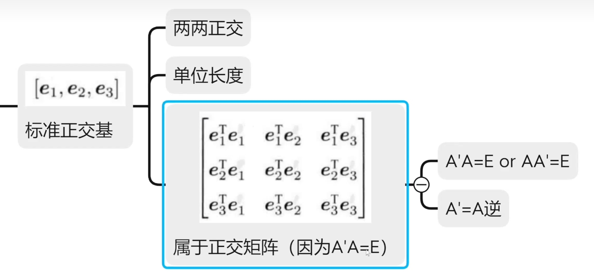
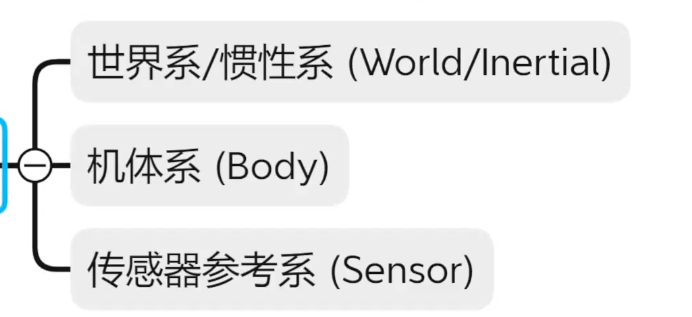
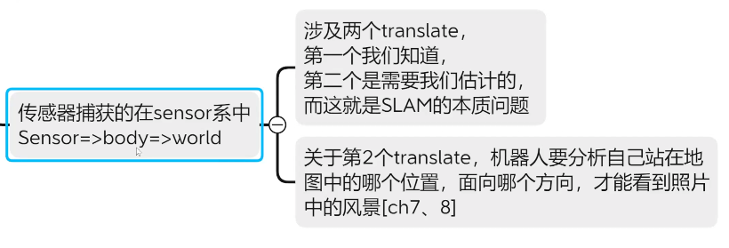
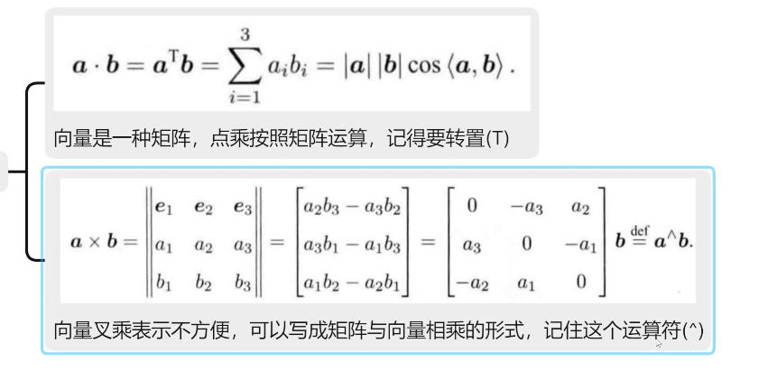
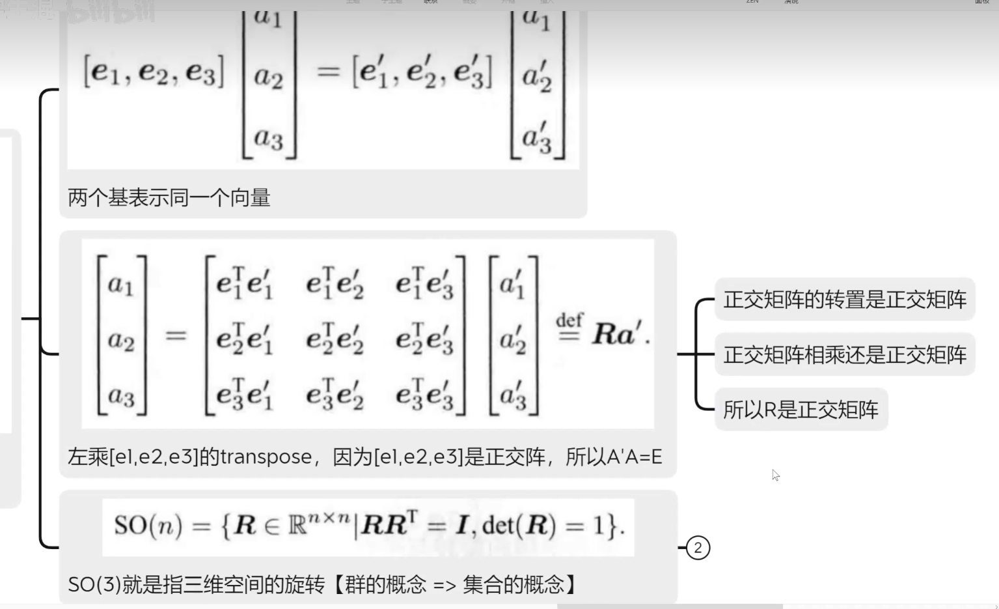
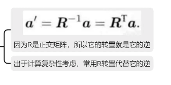
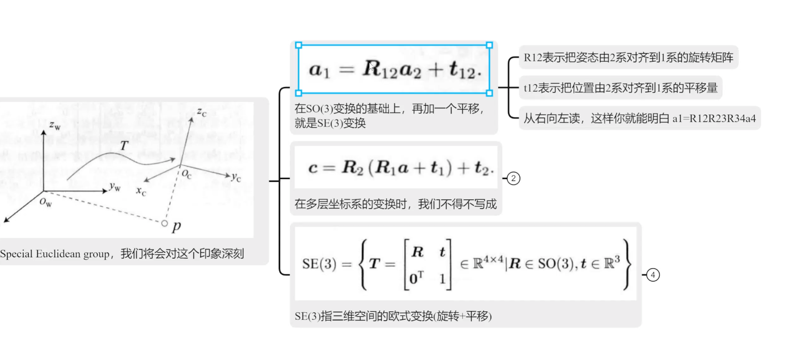
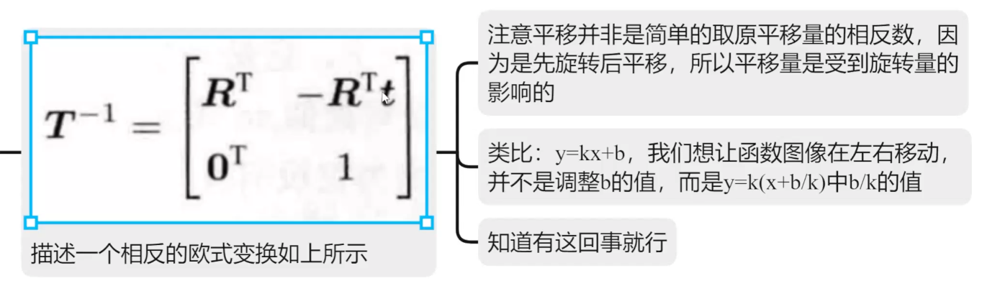
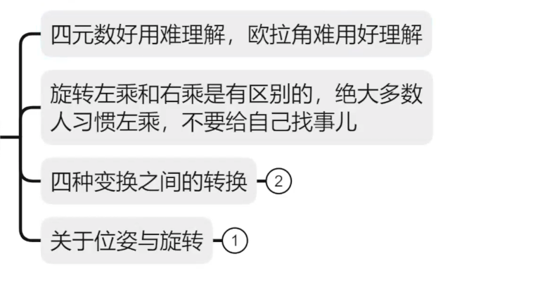

# SLAM14_2

**正交矩阵**




**坐标系**




**坐标系变换**







**旋转变换**







**旋转+平移**




**先旋转，后平移。**




**旋转矩阵**

**旋转向量，角轴**

**欧拉角： 旋转角度和顺序  : 出现死锁和不合适增量。**

**四元数：**




下面我用**视觉 SLAM 中“特征点法（Feature-based SLAM）”\**的视角，给你一个\**工程级、可落地的总体流程说明**。不讲空泛概念，而是对应真实系统（如 ORB-SLAM、PTAM、VINS-Fusion 中的视觉部分）。

------

# 一、特征点法 SLAM 的核心目标

特征点法视觉 SLAM 同时解决两个问题：

1. **位置估计（Localization）**
   → 当前相机在世界坐标系中的位姿 ( \mathbf{T}_{wc} )
2. **地图构建（Mapping）**
   → 稀疏三维地图（3D 特征点 / Landmark）

本质是一个 **长期递推的非线性最小二乘问题**。

------

# 二、整体系统流程（总览）

从工程角度，完整流程可以概括为：

```
输入图像流
   ↓
特征提取 & 描述
   ↓
特征匹配 / 数据关联
   ↓
相机位姿初估（PnP / 对极几何）
   ↓
三角化 → 新地图点
   ↓
局部 BA 优化
   ↓
关键帧管理 & 地图维护
   ↓
回环检测
   ↓
全局 BA / 位姿图优化
```

------

# 三、详细流程拆解（一步一步）

## 1️⃣ 图像输入与预处理

**输入：**

- 单目 / 双目 / RGB-D 相机图像

**预处理：**

- 去畸变（基于相机内参）
- 灰度化（多数特征算子）

------

## 2️⃣ 特征点提取（Feature Extraction）

### 常用特征：

- ORB（最主流）
- FAST + BRIEF
- SIFT / SURF（学术多，工程少）

### 输出：

- 2D 关键点：
  [
  \mathbf{u}_i = (x_i, y_i)
  ]
- 对应描述子：
  [
  \mathbf{d}_i \in \mathbb{R}^N
  ]

📌 **目标**：在不同视角、尺度、光照下稳定可匹配

------

## 3️⃣ 特征匹配 / 数据关联（Data Association）

### 两类匹配：

#### ① 帧间匹配（Tracking）

- 当前帧 ↔ 上一帧 / 参考关键帧
- 描述子距离（Hamming / L2）
- 加 RANSAC 剔除外点

#### ② 地图匹配（Map Tracking）

- 当前帧特征 ↔ 已有 3D 地图点投影
- 本质是 **2D–3D 匹配**

📌 **这是 SLAM 成败的关键**

------

## 4️⃣ 相机位姿估计（Pose Estimation）

### 情况 A：已有 3D 地图点

→ **PnP 问题**

[
\min_{\mathbf{T}} \sum_i | \pi(\mathbf{T} \mathbf{X}_i) - \mathbf{u}_i |^2
]

- EPnP / P3P + RANSAC
- 输出当前帧位姿 ( \mathbf{T}_{wc} )

------

### 情况 B：初始化阶段（无地图）

→ **对极几何**

- 估计：
  - 基础矩阵 ( \mathbf{F} )
  - 或本质矩阵 ( \mathbf{E} )
- 恢复：
  [
  \mathbf{R}, \mathbf{t}
  ]

📌 单目：**尺度不确定**
📌 双目 / RGB-D：直接得到尺度

------

## 5️⃣ 三角化（Triangulation）——地图构建核心

当两个关键帧观测到同一特征点：

[
\mathbf{X} = \text{Triangulate}(\mathbf{T}_1, \mathbf{T}_2, \mathbf{u}_1, \mathbf{u}_2)
]

结果：

- 新增一个 **3D 地图点（Landmark）**
- 关联多个关键帧观测

📌 地图本质是：

```text
Map = { KeyFrames + Landmarks + Observations }
```

------

## 6️⃣ 关键帧选择（Keyframe Selection）

不是每一帧都进地图。

常见准则：

- 平移 / 旋转超过阈值
- 跟踪点数下降
- 视差足够大

📌 **关键帧 = 地图结构的骨架**

------

## 7️⃣ 局部 BA（Local Bundle Adjustment）

### 优化变量：

- 当前关键帧位姿
- 相邻关键帧位姿
- 对应地图点位置

### 目标函数：

[
\min \sum_{i,j} | \pi(\mathbf{T}_i \mathbf{X}*j) - \mathbf{u}*{ij} |^2
]

📌 这是特征点法精度的根源
📌 使用：Gauss-Newton / LM（g2o / Ceres）

------

## 8️⃣ 地图维护（Map Maintenance）

- 剔除：
  - 误匹配地图点
  - 长期未观测点
- 合并重复点
- 更新可见性关系

------

## 9️⃣ 回环检测（Loop Closure）

### 目标：

解决累计漂移

### 方法：

- BoW（DBoW2）
- 特征词袋相似度

### 成功回环后：

- 估计两关键帧之间的位姿约束
- 加入位姿图

------

## 🔟 全局优化（Global Optimization）

两种常见方式：

### ① 位姿图优化（Pose Graph）

- 只优化关键帧位姿
- 快、稳定

### ② 全局 BA（代价高）

- 优化所有位姿 + 地图点

📌 回环后必做

------

# 四、用一句话概括“特征点法 SLAM”

> **通过稳定可匹配的特征点，在多视角下进行几何约束，将位姿估计与地图构建耦合为一个不断优化的非线性最小二乘问题。**

------

# 五、和你后续可能关心的问题

如果你接下来想继续深入，我可以直接按你需求来：

- 从 **ORB-SLAM3 源码**角度拆流程
- 讲 **PnP / BA 的数学推导**
- 对比 **特征点法 vs 直接法 vs 半直接法**
- 解释 **为什么深度学习还没完全替代特征点 SLAM**
- 结合你做 **视觉 + YOLO / 感知融合** 的场景讲

你更关心哪一个？


